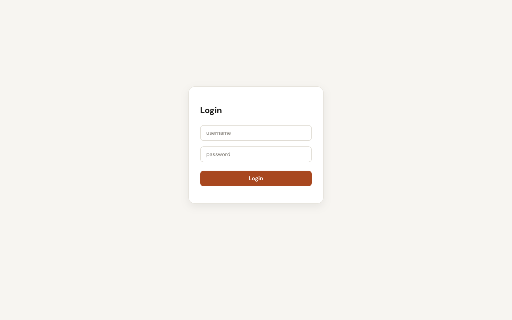
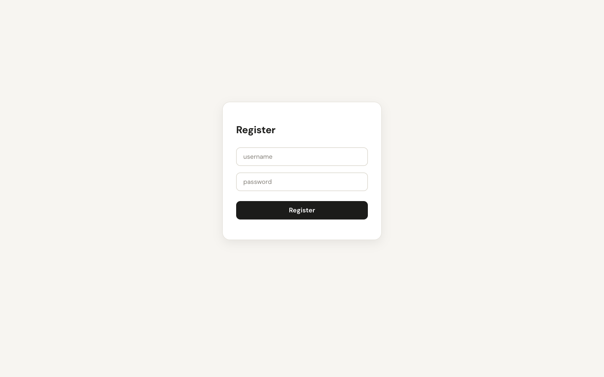

# FitRecs

FitRecs is a fashion outfit recommendation app. Upload a photo of an outfit and
a computer vision pipeline detects the clothing items, style, and gender
presented in the image; browse and filter a feed of outfits by clothing item,
style, gender, and date.

## Screenshots

| Explore | Upload |
| --- | --- |
|  |  |

| Login | Register |
| --- | --- |
|  |  |

## Tech stack

**Frontend** — `frontend/`
- [React](https://react.dev/) + [Vite](https://vitejs.dev/)
- [React Router](https://reactrouter.com/) for client-side routing and protected routes
- [Axios](https://axios-http.com/) for API requests, with an interceptor that attaches the JWT access token to every request
- [jwt-decode](https://github.com/auth0/jwt-decode) to check token expiry on the client
- A hand-rolled CSS design system (`frontend/src/styles/theme.css`): design tokens for color, spacing, radius, and shadow, plus shared component classes (`.btn`, `.input`, `.card`, etc.) reused across every page for a consistent look

**Backend** — `backend/`
- [Django](https://www.djangoproject.com/) + [Django REST Framework](https://www.django-rest-framework.org/)
- [Simple JWT](https://django-rest-framework-simplejwt.readthedocs.io/) for access/refresh token authentication
- [django-cors-headers](https://github.com/adamchainz/django-cors-headers) to allow the Vite dev server to call the API
- SQLite for the database
- [Cloudinary](https://cloudinary.com/) for hosted image storage
- [Roboflow](https://roboflow.com/) computer vision models for clothing item segmentation, style classification, and gender classification (`backend/annotate/tasks.py`)

## Project structure

```
frontend/   React + Vite single-page app
backend/    Django REST API
  api/          user registration/auth endpoints
  annotate/     image upload, Roboflow annotation pipeline, outfit feed endpoints
```

## Getting started

### Prerequisites
- Node.js 18+
- Python 3.11+
- A [Cloudinary](https://cloudinary.com/) account and a [Roboflow](https://roboflow.com/) API key (needed for the upload/annotation pipeline; the explore/login/register pages work without them)

### Backend

```bash
cd backend
python3 -m venv venv
source venv/bin/activate
pip install -r ../requirements.txt

cp .env.example .env   # fill in CLOUDINARY_URL, ROBOFLOW_API_KEY, DJANGO_SECRET_KEY

python manage.py migrate
python manage.py runserver
```

The API runs at `http://localhost:8000`.

### Frontend

```bash
cd frontend
npm install
cp .env.example .env   # VITE_API_URL should point at the backend above
npm run dev
```

The app runs at `http://localhost:5173`.

## Environment variables

| File | Variable | Description |
| --- | --- | --- |
| `backend/.env` | `DJANGO_SECRET_KEY` | Django's secret key. Generate one with `python -c "from django.core.management.utils import get_random_secret_key; print(get_random_secret_key())"` |
| `backend/.env` | `DJANGO_DEBUG` | `True` for local development |
| `backend/.env` | `CLOUDINARY_URL` | Cloudinary connection string, from your Cloudinary dashboard |
| `backend/.env` | `ROBOFLOW_API_KEY` | API key for the Roboflow models used to annotate uploads |
| `frontend/.env` | `VITE_API_URL` | Base URL of the Django API |

None of these `.env` files are committed — copy the corresponding `.env.example` and fill in your own values.
